Interactex
==========

Interactex is an environment to create smart textile applications that interact with a smartphone.

# Overview

 Figure below shows Interactex's high-level design and workflow. 

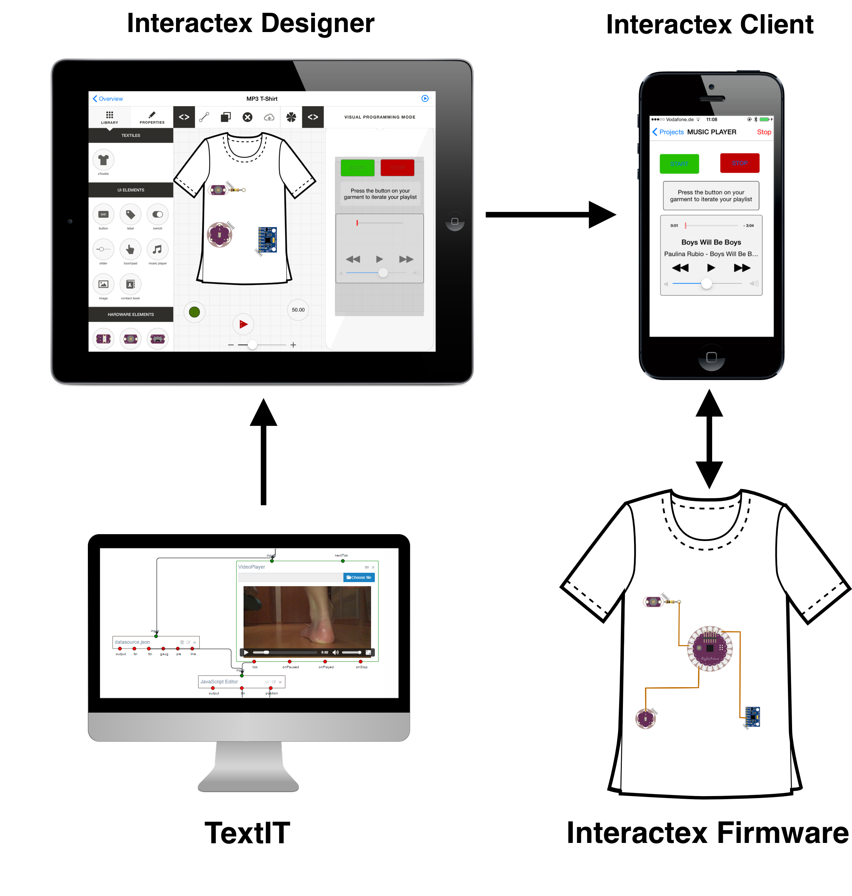

Interactex Designer is used to create the application and circuit design visually. Interactex Client executes applications and communicates with the smart textile. Interactex Client runs on a smartphone. Interactex Firmware runs on a microcontroller attached to the smart textile and executes commands received from Interactex Client. TextIT is used to create and export functionality components that can be imported into Interactex Designer.

## Interactex Designer

Interactex Designer runs on an iPad device and is available in the AppStore: 

https://itunes.apple.com/us/app/interactex-designer/id973912620?mt=8

The image below describes the main components of the user interface.

Applications created in Interactex Designer are transferred wirelessly to Interactex Client. Interactex has three main modes: Circuit Layout, Visual Programming and Simulation Modes.

### Circuit Layout Mode

In Circuit Layout Mode, users lay out the hardware devices on the smart textile and draw their circuits.

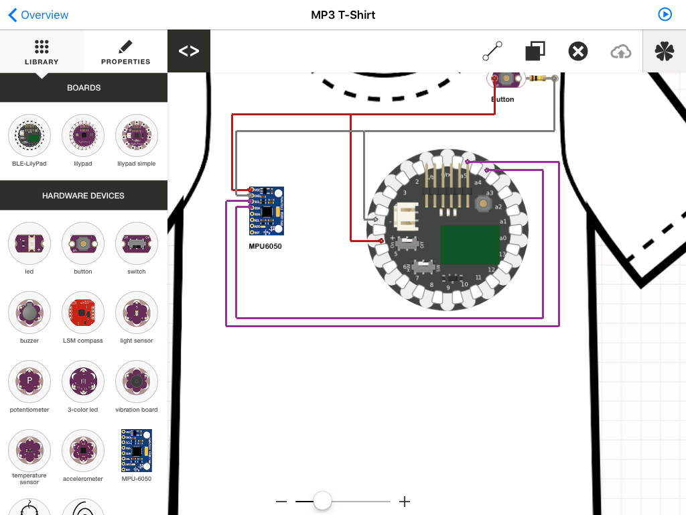

### Visual Programming Mode

In Visual Programming Mode, a palette with reusable objects is made available.

Interactex follows a flow-based programming paradigm. Events of an object are coupled to functions of another object.
 
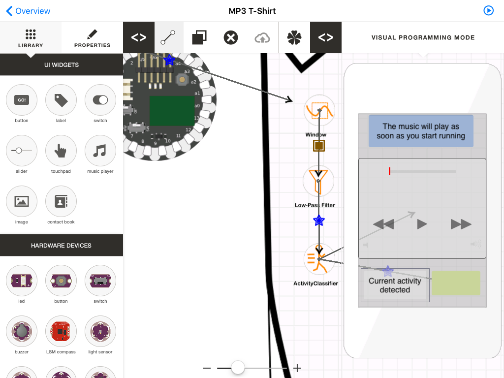

A new visual programming interface that will display object's events, methods and properties and their couplings is under development. A screenshot of the new visual programming interface is shown below:

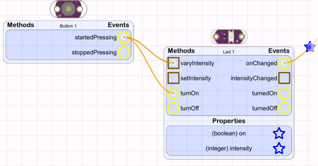

### Simulation Mode

In Simulation Mode, applications are simulated and display runtime information for debugging purposes. Sensor data is simulated by users by performing multitouch gestures on sensors' visual representations. The states of output devices is represented visually with animations, sounds and images. 

The screenshot below shows how different objects are represented in Simulation Mode.

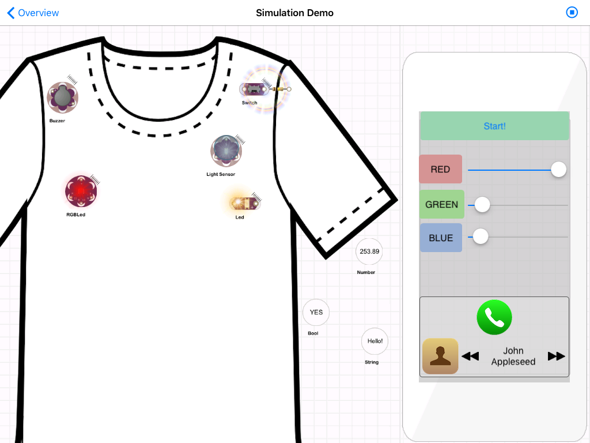

## Interactex Client

Interactex Client is an iPhone and iPod App. Interactex Client is available in the AppStore: 
https://itunes.apple.com/nz/app/interactex-client/id1031238223?mt=8

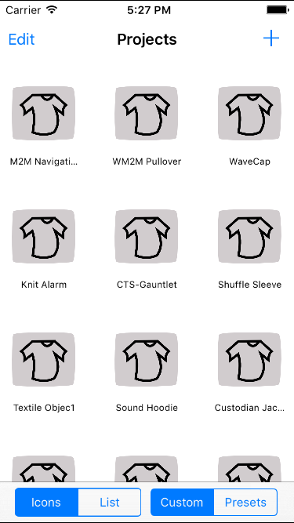

## TextIT

TexIT is a hybrid visual and textual programming environment, currently under development. 

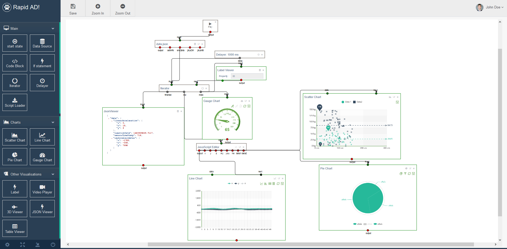

# Interactex Objects Overview

Interactex offers different types of reusable objects. 

## UI Widgets

UI Widgets conform the user interface on the smartphone. 

| Image                                               | Name         | Description                                                                                                                                |
|:---------------------------------------------------:|--------------|--------------------------------------------------------------------------------------------------------------------------------------------|
|      |    Button    | Triggers events when pressed and when released.                                                                                            |
|        |     Label    | Displays text and numbers.                                                                                                                 |
|      |    Switch    | Triggers events when switched on or off.                                                                                                   |
|       |    Slider    | Used to select a value from a range of values. Triggers events when its handle is moved by the user.                                       |
|     |   Touchpad   | Triggers events when the user performs the following multitouch gestures on it: tap, double tap, long tap, pinch and pan.                  |
|  | Music Player | Accesses mobile device's music library, offers functionality to iterate through the music list, play songs and displays music information. |
|    |  Image View  | Displays an image.                                                                                                                         |
|  | Contact Book | Accesses user’s contact book and offers functionality to iterate through contacts and make calls.                                          |
|      |    Monitor   | Displays values over time (e.g. sensor readings).                                                                                          |

## Hardware Devices

Hardware devices are sensors and output devices. Interactex supports every hardware device in the Arduino Lilypad kit and custom-made textile sensors and output devices (e.g. Textile Sensor and Textile Speaker) 

|                              Image                              |        Name        |                                                                                                                                                                                                Description                                                                                                                                                                                               |
|:---------------------------------------------------------------:|:------------------|:--------------------------------------------------------------------------------------------------------------------------------------------------------------------------------------------------------------------------------------------------------------------------------------------------------------------------------------------------------------------------------------------------------|
|                |         LED        | A Light Emitting Diode (LED). Can be turned on or off and its intensity can be set (set the corresponding pin to PWM mode in the Lilypad info panel if you intend to change its intensity)                                                                                                                                                                                                               |
|             |       Button       | A Lilypad button that can be pressed. Triggers events when pressed and when released.                                                                                                                                                                                                                                                                                                                    |
|             |       Switch       | A Lilypad switch. Generates events when switched on or off.                                                                                                                                                                                                                                                                                                                                              |
|             |       Buzzer       | Represents a Lilypad Buzzer, an element that produces a sound frequency. It can be turned on, turned off and its sound frequency can be set.                                                                                                                                                                                                                                                             |
|          |     LSMCompass     | Represents the LSM303 Accelerometer and Magnetometer. Should be connected to the SCL and SDA pins for I2C communication. Measures acceleration forces in a 3D space.                                                                                                                                                                                                                                     |
|       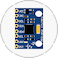      |      MPU-6050      | Measures acceleration acceleration forces and orientation (gravity) in a 3D space.                                                                                                                                                                                                                                                                                                                       |
|         |    Light Sensor    | Represents a Lilypad Light Sensor. Measures light intensity.                                                                                                                                                                                                                                                                                                                                             |
|  | Temperature Sensor | Represents a Lilypad Temperature Sensor. It works similar to the Light Sensor. It offers an event: valueChanged which notifies when the reading of the sensor changed.                                                                                                                                                                                                                                   |
|      |    Potentiometer   | Generates events according to three modes: always, InRange and Once. The Always mode will trigger an event whenever the hardware value changed. The InRange mode generates an event when the hardware value changed and this value lies within a certain range, which can be configured in the object’s properties. The Once mode will trigger an event once when the value lies within a certain range. |
|      |   Three-Color LED  | An LED that emits light in multiple colors.                                                                                                                                                                                                                                                                                                                                                              |
|     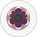     |     Vibe Board     | Represents a Lilypad vibration board (produces vibrations). It can be turned on, off and its vibration frequency can be set.                                                                                                                                                                                                                                                                             |
|      |    Accelerometer   | It offers methods for reading x, y and z. Should be connected to three analog input pins.                                                                                                                                                                                                                                                                                                                |
|      |   Textile Sensor   | Represents an analog textile sensor.                                                                                                                                                                                                                                                                                                                                                                     |
|     |   Textile Speaker  | Represents a radio module. Its frequency, volume, sender can be configured.                                                                                                                                                                                                                                                                                                                              |

## Variables

Variables store data.

|                          Image                         |      Name     |                                                                                                                                                                            Description                                                                                                                                                                           |
|:-------------------------------------------------------:|:--------------|:----------------------------------------------------------------------------------------------------------------------------------------------------------------------------------------------------------------------------------------------------------------------------------------------------------------------------------------------------------------|
|  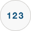 |  Number Value | Represents a number (equivalent to a variable in programming). Can be used for example together with the comparator in order to detect when a specific object’s property (such as the buzzer’s frequency or the LED’s intensity) reaches a specific value. Generates an event when its value changes. This is the event that can be connected to the comparator. |
|  | Boolean Value | Represents a Boolean value (equivalent to a variable in programming).  It can be used for example together with a grouper condition.                                                                                                                                                                                                                             |
|   |  String Value | Represents a constant String (equivalent to a constant variable in programming). It can be used to set the text of a label. In the future, it will be formateable such that users can mix text and numbers, while these numbers could be sensor values.                                                                                                          |

## Comparison Operators

Comparison operators compare two values and return the result of the comparison as a Boolean.

|                             Image                             | Name         | Description                                                             |
|:-------------------------------------------------------------:|:-------------|:------------------------------------------------------------------------|
|        |    Bigger    | Compares whether the first operand is bigger than the second.           |
|        |  BiggerEqual | Compares whether the first operand is bigger or equal than the second.  |
|       |    Smaller   | Compares whether the first operand is smaller than the second.          |
|  | SmallerEqual | Compares whether the first operand is smaller or equal than the second. |
|        |     Equal    | Compares whether the first operand is equal than the second.            |
|        |   NotEqual   | Compares whether the first operand is not equal to the second.          |
|           |      And     | Checks whether both operands are true.                                  |
|            |      Or      | Checks whether either operand is true.                                  |

## Arithmetic Operators

Arithmetic operators operate two numbers and return the result of the operation.

|                              Image                             |      Name      |                               Description                              |
|:--------------------------------------------------------------:|:---------------|:----------------------------------------------------------------------|
|        |    Addition    | Adds two numbers.                                                      |
|     |   Subtraction  | Subtracts operand2 from operand1.                                      |
|  | Multiplication | Multiplies two numbers.                                                |
|        |    Division    | Divides operand1 by operand2.                                          |
|          |     Modulo     | Calculates the residual of the division between operand1 and operand2. |

## Signal Processing

Signal processing elements are filters, feature extractors and classification algorithms.

|                                  Image                                  |         Name        |                                                                                      Description                                                                                      |
|:-----------------------------------------------------------------------:|:--------------------|:-------------------------------------------------------------------------------------------------------------------------------------------------------------------------------------|
|             |        Window       | Takes signal values as input, and returns chunks of the same signals, which might overlap.                                                                                            |
|      |   Low-Pass Filter   | Low-passes a signal.                                                                                                                                                                  |
|     |   High-Pass Filter  | High-passes a signal.                                                                                                                                                                 |
|               |    Mean Extractor   | Calculates the mean of a set of values.                                                                                                                                               |
|          | Deviation Extractor | Calculates the deviation of a set of values.                                                                                                                                          |
|       |    Peak Detector    | Calculates the peak in a set of values and provides the peak's value and index in an event. It offers methods to set the range in a set of samples where the peak should be searched. |
|         |  Motion Classifier  | Classifies user motion based on accelerometer input. Supported motions are: 'walking', 'running', 'climbing' and 'not moving'.                                                        |
|  |  Posture Classifier | Clasifies user postures based on IMU input. Supported postures are: 'standing', 'lying down on stomach' and 'lying down on back'.                                                     |

## Utility Objects

Utility Objects represent software functionality commonly useful when developing software for smart textiles.

|                          Image                          |   Name   |                                                                                                                                                                                                            Description                                                                                                                                                                                                            |
|:-------------------------------------------------------:|:---------|:----------------------------------------------------------------------------------------------------------------------------------------------------------------------------------------------------------------------------------------------------------------------------------------------------------------------------------------------------------------------------------------------------------------------------------|
|  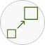  |  Mapper  | Scales values. This is useful to make values fit to the range required by other objects. For example, the Slider UI widget produces by default values in the range [0 255] and the Buzzer hardware element requires a frequency in the range [0 20000]. The Mapper would take the Slider's input range [Min1 Max1] and scale it linearly to the Buzzer's output range [Min2 Max2]. Generates an event whenever the value changes. |
|  | Recorder | Provides a way to store a set of values (e.g. from a sensor) and to feed a set of values into other objects.                                                                                                                                                                                                                                                                                                                      |
|     |   Timer  | Generates an event after x time. It's trigger time and whether it should trigger once or many times can be configured over the properties panel.                                                                                                                                                                                                                                                                                  |
|     |   Sound  | Represents a sound. It offers a single method to play it.                                                                                                                                                                                                                                                                                                                                                                         |

# Object's Events, Methods and Properties

Objects in Interactex emit events and contain methods with executable functionality and properties (equivalent to instance variables in object-oriented programming). 

## UI Widgets
|                        Image                        |     Name     |                                    Events                                   |                         Methods                        |     Properties    |
|:---------------------------------------------------:|:------------:|:---------------------------------------------------------------------------:|:------------------------------------------------------:|:-----------------:|
|      |    Button    |                      buttonPressed(), buttonReleased()                      |                            -                           | pressed : Boolean |
|        |     Label    |                                      -                                      |           setText(String), appendText(String)          |   text : String   |
|      |    Switch    |               switchedOn(), switchedOff(), onChanged(Boolean)               |                            -                           |    on : Boolean   |
|       |    Slider    |                             valueChanged(Number)                            |                            -                           |   value : Number  |
|     |   Touchpad   | pannedX(Number), pannedY(Number), tapped(), doubleTapped(), pinched(Number) |                            -                           |         -         |
|  | Music Player |                             started(), stopped()                            | play(), pause(), next(), previous(), setVolume(Number) |  volume : Number  |
|    |  Image View  |                                      -                                      |                            -                           |         -         |
|  | Contact Book |                                      -                                      |               call(), previous(), next()               |                   |
|      |    Monitor   |                                      -                                      |          addValue1(Number), addValue2(Number)          |         -         |

## Hardware Devices
|                              Image                              |        Name        |                          Events                         |                                      Methods                                     |                 Properties                |
|:---------------------------------------------------------------:|:------------------:|:-------------------------------------------------------:|:--------------------------------------------------------------------------------:|:-----------------------------------------:|
|                |         LED        |                 turnedOn(), turnedOff()                 |                     turnOn(), turnOff(), setIntensity(Number)                    |      on : Boolean, intensity : Number     |
|             |       Button       |            buttonPressed(), buttonReleased()            |                                         -                                        |             pressed : Boolean             |
|             |       Switch       |   switchedOn(), switchedOff(), switchChanged(Boolean)   |                                         -                                        |                     -                     |
|             |       Buzzer       |                            -                            |                     turnOn(), turnOff(), setFrequency(Number)                    |             frequency : Number            |
|          |     LSMCompass     |   headingChanged(Number), accelerationChanged(Object)   |                                         -                                        |  acceleration : Object, heading : Number  |
|             |      MPU-6050      | accelerationChanged(Object), orientationChanged(Object) |                                  start(), stop()                                 | acceleration: Object, orientation: Object |
|         |    Light Sensor    |                   valueChanged(Number)                  |                                  start(), stop()                                 |          lightIntensity : Number          |
|  | Temperature Sensor |                   valueChanged(Number)                  |                                  start(), stop()                                 |            temperature : Number           |
|      |    Potentiometer   |                   valueChanged(Number)                  |                                         -                                        |               value : Number              |
|      |   Three-Color LED  |                            -                            |      turnOn(), turnOff(), setRed(Number), setGreen(Number), setBlue(Number)      |                     -                     |
|          |     Vibe Board     |                            -                            |                     turnOn(), turnOff(), setFrequency(Number)                    |             frequency : Number            |
|      |    Accelerometer   |  xChanged(Number), yChanged(Number), zChanged(Number),  |               xChanged(Number), yChanged(Number), zChanged(Number)               |     x : Number, y : Number, z : Number    |
|      |   Textile Sensor   |                            -                            |                                                                                  |               value : Number              |
|     |   Textile Speaker  |                    onChanged(Boolean)                   | turnOn(), turnOff(), setFrequency(Number), setVolume(Number), setSender(Boolean) |                     -                     |

## Comparison Operators

Comparison Operators emit the conditionIsTrue() event if the fist input variable is bigger (or smaller, equal, etc.) than the second input variable and otherwise emit the conditionIsFalse() event. Comparison Operators emit the alternative conditionChanged() event.

|                             Image                             |     Name     |                              Events                              |                Methods               |    Properties    |
|:-------------------------------------------------------------:|:------------:|:----------------------------------------------------------------:|:------------------------------------:|:----------------:|
|        |    Bigger    | conditionIsTrue(), conditionIsFalse(), conditionChanged(Boolean) | setValue1(Number), setValue2(Number) | isTrue : Boolean |
|        |  BiggerEqual | conditionIsTrue(), conditionIsFalse(), conditionChanged(Boolean) | setValue1(Number), setValue2(Number) | isTrue : Boolean |
|       |    Smaller   | conditionIsTrue(), conditionIsFalse(), conditionChanged(Boolean) | setValue1(Number), setValue2(Number) | isTrue : Boolean |
|  | SmallerEqual | conditionIsTrue(), conditionIsFalse(), conditionChanged(Boolean) | setValue1(Number), setValue2(Number) | isTrue : Boolean |
|        |     Equal    | conditionIsTrue(), conditionIsFalse(), conditionChanged(Boolean) | setValue1(Number), setValue2(Number) | isTrue : Boolean |
|        |   NotEqual   | conditionIsTrue(), conditionIsFalse(), conditionChanged(Boolean) | setValue1(Number), setValue2(Number) | isTrue : Boolean |
|           |      And     | conditionIsTrue(), conditionIsFalse(), conditionChanged(Boolean) | setValue1(Number), setValue2(Number) | isTrue : Boolean |
|            |      Or      | conditionIsTrue(), conditionIsFalse(), conditionChanged(Boolean) | setValue1(Number), setValue2(Number) | isTrue : Boolean |

## Arithmetic Operators

Arithmetic Operators emit the computed(Number) event with the result of the operation.

|                              Image                              |      Name      |      Events      |                       Methods                       | Properties |
|:---------------------------------------------------------------:|:--------------:|:----------------:|:---------------------------------------------------:|:----------:|
|        |    Addition    | computed(Number) | setOperand1(Number), setOperand2(Number), compute() |      -     |
|     |   Subtraction  | computed(Number) | setOperand1(Number), setOperand2(Number), compute() |      -     |
|  | Multiplication | computed(Number) | setOperand1(Number), setOperand2(Number), compute() |      -     |
|        |    Division    | computed(Number) | setOperand1(Number), setOperand2(Number), compute() |      -     |
|          |     Modulo     | computed(Number) | setOperand1(Number), setOperand2(Number), compute() |      -     |

## Variables

Variables have an event to set the value to be stored in the Variable and emit the valueChanged() event when the value changes its value. The value stored in a Variables can also be accessed through the 'value' property. 

|                           Image                          |      Name     |         Events        |      Methods      |    Properties   |
|:--------------------------------------------------------:|:-------------:|:---------------------:|:-----------------:|:---------------:|
|   |  Number Value | valueChanged(Number) |  setValue(Number) |  value : Number |
|  | Boolean Value | valueChanged(Boolean) | setValue(Boolean) | value : Boolean |
|   |  String Value | valueChanged(String) |  setValue(String) |  value : String |

## Signal Processing
|                                  Image                                  |         Name        |                     Events                    | Methods                                                                        | Properties |
|:-----------------------------------------------------------------------:|:-------------------:|:---------------------------------------------:|:------------------------------------------------------------------------------:|:----------:|
|             |        Window       |                 filled(Object)                |                                addValue(Number)                                |      -     |
|      |   Low-Pass Filter   |                filteredValues()               |                       addValue(Number), removeAllValues()                      |      -     |
|     |   High-Pass Filter  |                filteredValues()               |                       addValue(Number), removeAllValues()                      |      -     |
|               |    Mean Extractor   |               featureExtracted()              |                 addValue(Number), removeAllValues(), compute()                 |      -     |
|          | Deviation Extractor |               featureExtracted()              |                 addValue(Number), removeAllValues(), compute()                 |      -     |
|       |    Peak Detector    |               featureExtracted()              | addValue(Number), removeAllValues(), compute(), setRangeStart(), setRangeEnd() |      -     |
|         |  Motion Classifier  | walking(), running(), climbing(), notMoving() |                                addSample(Object)                               |      -     |
|  |  Posture Classifier |       standing(), lyingDown(), lyingUp()      |                                addSample(Object)                               |      -     |

## Utilities
|                          Image                          |   Name   |               Events              |                                        Methods                                       |   Properties   |
|:-------------------------------------------------------:|:--------:|:---------------------------------:|:------------------------------------------------------------------------------------:|:--------------:|
|    |  Mapper  |                 -                 | setMin1(Number), setMax1(Number), setMin2(Number), setMax2(Number), setValue(Number) | value : Number |
|  | Recorder | startRecording(), stopRecording() |                  startRecording(), stopRecording(), addValue(Number)                 |        -       |
|     |   Timer  |            triggered()            |                                    start(), stop()                                   |        -       |
|     |   Sound  |        valueChanged(Number)       |                                        play()                                        |        -       |

